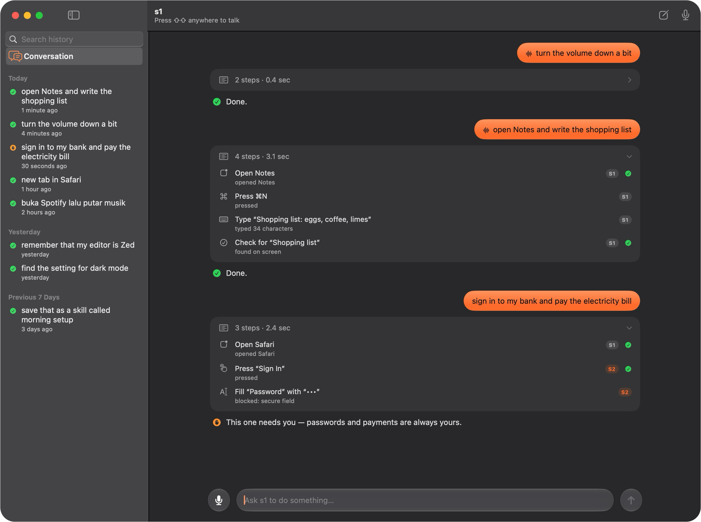

<p align="center"></p>

# s1

[](https://github.com/Matthew-Eucaristo/s1/actions/workflows/swift.yml)
[](LICENSE)


Voice-first macOS agent. A fast local **System 1** (a protocol — swap the implementation) handles most steps; a pluggable **System 2** (LLM, local or cloud) is consulted only when S1 is unsure. Every step is logged with evidence.

**Status:** P0 harness, P1 real run, P2 S1+S2 brains, P4 voice, **macOS app (Liquid Glass)**, **always-on companion (global hotkey → continuous listening)** — all verified on real macOS 26. See `PLAN.md` for the roadmap.

<p align="center"></p>

- Swift 6, SwiftPM, macOS 15+ (Speech features target macOS 26+), Apple Silicon.
- No sandbox (Accessibility API requires it) — distribute outside the App Store.
- MIT licensed. OSS components used are credited in `ATTRIBUTIONS.md`.

## Install

```bash
# Homebrew (once the tap is published):
brew tap Matthew-Eucaristo/tap && brew install s1

# From source — release build, installs to ~/.local/bin:
git clone https://github.com/Matthew-Eucaristo/s1.git && cd s1
./scripts/install-local.sh            # or: swift build -c release && cp .build/release/s1 /usr/local/bin/

s1 preflight                          # shows which macOS permissions are missing

# The app:
./scripts/make-app.sh                 # builds dist/S1.app (universal, ad-hoc signed)
open dist/S1.app                      # or copy it to /Applications
```

## Try it (3 steps)

```bash
git clone https://github.com/Matthew-Eucaristo/s1.git && cd s1
swift test                      # harness: gate, jsonl, dry-run, loop — no permissions needed
swift run s1 demo --dry-run     # full loop, touches nothing
```

Then the real run (needs both permissions below):

```bash
swift run s1 demo               # opens TextEdit, types, verifies on-screen — logs to artifacts/
```

## Voice

```bash
swift run s1 transcribe --file cmd.aiff --locale en-US   # on-device STT
swift run s1 say "halo" --language id-ID                # on-device TTS
swift run s1 listen --file cmd.aiff                     # voice -> action run
swift run s1 listen                                     # live mic -> action run
```

SpeechAnalyzer (macOS 26) is used when its assets exist; otherwise s1 falls
back to `SFSpeechRecognizer` — still on-device. Dictation must be enabled
(System Settings → Keyboard → Dictation).

**Custom vocabulary** — s1 always feeds the recognizer contextual strings:
installed app names are learned automatically (say "open Linear" and it
lands). Add your own jargon to `~/.s1/config.json`:

```json
{ "vocabulary": ["s1", "Warp", "JIRA"] }
```

or per command: `--vocabulary "Warp,JIRA"`. Apple's limit is 100 phrases —
your words rank first, app names fill the rest.

## Always-on companion

```bash
swift run s1 serve              # daemon: arms the global hotkey, then idles (zero mic/CPU)
swift run s1 serve --wake       # start listening immediately (for SSH/headless use)
```

Press **⇧⇧** (double-tap either Shift) or **⌃⌥Space** anywhere on the Mac:
s1 toggles between `idle` and `listening`. While listening it loops
**hear → run the goal → speak → hear** until you say a stop phrase
(`stop`/`berhenti`/`tidur`/`istirahat`/`sleep`…) or press the hotkey again; it auto-sleeps
after `--idle-turns` silent turns or repeated STT errors — and after
repeated run failures (a dead endpoint can't spin hot). Idle uses no mic
and no model — flat battery. One listener per machine: `~/.s1/serve.pid`
is the lock, so `s1 serve` alongside S1.app is refused instead of
double-triggering on the same hotkey. Typing fast capital letters does
NOT fire ⇧⇧ — any key between the taps resets the gesture.

```bash
s1 status      # daemon alive? state? is a run in progress?
s1 stop        # abort any in-flight run + stop the listener
               # (SIGTERM for `s1 serve`; the app only sleeps — window survives)
```

`~/.s1/run.pid` marks screen ownership — a second agent run refuses while
one is live (two agents typing at once is the failure this prevents).
Stale pid files self-heal: liveness + executable identity are checked,
so a recycled pid never blocks you — and `s1 stop` can't kill the wrong
process. `~/.s1/serve-state.json` is the daemon's last state (for scripts).

The S1 app is the same daemon with a menu-bar face (`MenuBarExtra`): the
waveform icon shows idle/listening/running, toggles listening, and offers
**Launch at login** (`SMAppService.mainApp`). The window stays available
for one-shot commands.

Perception includes a whole-Mac view: every observation lists running apps
+ window titles (`AppState`), and `open X` resolves apps outside the
standard dirs via Spotlight (`mdfind kMDItemKind == 'Application'`).

## Siri, Shortcuts, Spotlight

The app ships **App Intents** — the same actions the UI performs are
system-discoverable:

- "Ask s1 to open TextEdit" / "Run … in s1" → `RunGoalIntent` (brings the
  window forward, goal prefilled and executed)
- "Wake s1" / "Toggle s1 listening" → `ToggleListeningIntent` (same switch
  as the hotkey)

Both appear in Shortcuts.app for automation, and Siri picks up the phrases
automatically.

## Brains

```bash
# Deterministic S1 — no model, parses "open X, type Y, done" intents
swift run s1 run --policy ax --goal "open TextEdit, wait 2000, type hi, done"

# VLM S1 — any OpenAI-compatible endpoint (Ollama, MLX, LM Studio, cloud)
swift run s1 run --policy vlm --vlm-model gemma3:4b --goal "type hi, done"

# S2 escalation — s1:ax handles known steps; unknown ones go to the LLM
swift run s1 run --policy ax --s2 --goal "open TextEdit, click the document, done"
```

S2 endpoint via env: `S1_S2_BASE` (default `http://localhost:11434/v1`),
`S1_S2_MODEL` (`gemma3:4b`), `S1_S2_KEY`. Every escalation lands in
`steps.jsonl` as `escalation:{to, reason}`.

### Swapping brains — the easy way

Everything lives in `~/.s1/config.json` — no rebuild, no code:

```json
{
  "vlm": { "base": "http://localhost:11434/v1", "model": "gemma3:4b" },
  "s2":  { "base": "https://api.openai.com/v1", "model": "gpt-5", "key": "sk-…" },
  "locale": "id-ID", "speak": true
}
```

Precedence: **CLI flag > env var > config file > built-in default**. Any
OpenAI-compatible `/chat/completions` endpoint works for both brains —
Ollama, LM Studio, vLLM, MLX, Groq, OpenAI. `s1 config` prints what's
resolved and where to edit; the app writes the same file, so GUI settings
apply to the CLI too. To write a custom brain (a `Policy` or `Reasoner`
conformance — swap internals, not the loop), see `docs/adding-a-brain.md`.

## Task library & run tooling

```bash
swift run s1 run --task open-app --policy ax        # goals live in tasks/*.txt
swift run s1 metrics artifacts/<run-dir>            # decisions/escalations/errors/verify stats
swift run s1 replay artifacts/<run-dir> --dry-run   # re-execute a recorded run
swift run s1 tasks                                # list what's in the library
```

Notes on the library: `download-file` expects a local server — run
`python3 -m http.server 8000` in a folder containing `test.zip` first
(Safari downloads it, then s1 opens the Downloads popover and verifies the
entry; on repeat runs Safari renames to `test-1.zip` — download fresh or
adjust the `verify` token). `read-screen` verifies text an earlier task
typed into TextEdit.

## Developer commands

```bash
swift run s1 ax                 # dump the frontmost app's AX tree (debug perceive)
swift run s1 capture --out out.png # one screenshot (checks Screen Recording grant)
swift run s1 say "halo" --language id-ID # TTS only
swift run s1 transcribe --file audio.aiff # STT only
swift run s1 run --policy scripted --plan plan.json # replay a hand-written plan
```

A plan file is a JSON array of steps — each `action` is the enum's
single-key form (`{"<case>":{params}}`):

```json
[{"action":{"openApp":{"name":"TextEdit"}},"rationale":"open"},
 {"action":{"typeText":"halo"},"rationale":"type"},
 {"action":{"done":{"summary":"ok"}},"rationale":"fin"}]
```

## Permissions (macOS TCC)

`s1 preflight` reports what's missing and prints exact instructions.

| Permission | Why |
|---|---|
| Accessibility | CGEvent input + reading the AX tree (the main perception path) |
| Screen & System Audio Recording | on-demand screenshots (ScreenCaptureKit) — **relaunch s1 after first grant** |
| Microphone | voice input only (P4) |
| Input Monitoring | the global hotkey (serve/app) — separate bucket from Accessibility; s1 requests it automatically the first time the tap can't be installed |

When running via `swift run`, grant the permission to the produced binary
(`.build/debug/s1`) or to your terminal, then relaunch.

## Layout

```
Sources/S1Core/
  Perceive/  CGWindowList + AXUIElement tree + ScreenCaptureKit (on-demand)
  Act/       CGEvent mouse/keyboard + AX actions; DryRunActuator
  Policy/    protocol Policy (S1): Dummy · Scripted · AX (deterministic) · VLM
  Reasoner/  protocol Reasoner (S2): OpenAI-compatible chat endpoints
  Voice/     SpeechAnalyzer + SFSpeechRecognizer STT · AVSpeech TTS
  Safety/    Action classes, hard deny-list, kill switch
  Preflight/ TCC checks incl. the relaunch invariant
  Artifacts/ per-run dir: meta.json + steps.jsonl + screens/
  Loop/      see → decide → gate → act → verify → log · Serve — always-on
             listen→run→speak daemon, auto-sleep, kill switch · Runner lock
  Hotkey/    passive CGEvent tap (listen-only): ⇧⇧ double-tap + ⌃⌥Space chord
Sources/s1/  CLI: preflight · run · demo · capture · ax · transcribe · say
             · listen · serve · status · stop · config · tasks · metrics
             · replay
Sources/S1App/ macOS app (SwiftUI, macOS 26 Liquid Glass): menu-bar companion
             (MenuBarExtra + hotkey + login item), mic + file STT, live step
             feed, brain/locale/model pickers, permission status, App Intents
```

## Safety

- Action classes: `read` always allowed · `reversible` logged · `irreversible` needs human.
- Hard deny-list: credentials/OTP/card data, purchases, destructive shell, power/session commands — never executed, escalated to a human.
- Secure-field guard: typing into a focused `AXSecureTextField` (or `axSetValue` on one) routes to `needsHuman` — the agent never fills a password box. Models see `[secure]` markers and a never-type rule.
- Kill-switch file checked every step (default path set per run).
- Stuck-loop guard: the same action three times in a row aborts the run (`stuckLoop`).
- Every run writes `artifacts/<ts>-<goal>/` with `steps.jsonl` — decided-by (`s1:`/`s2:`), confidence, gate verdict, verification result, escalation reason, and `modelReply` (the raw model output).

## How S1 thinks

- **AX policy** (`--policy ax`, default): zero model, parses `open X, type Y, done` intents and executes deterministically — the baseline every smarter S1 must beat.
- **VLM policy** (`--policy vlm`): goal → deterministic intent cursor (shared grammar with AX policy) → the model grounds ONE intent per step. Small local models decide actions; they don't track whole plans. Truncated/malformed JSON is salvaged field-by-field before a strict-JSON retry.
- **S2** (`--s2`): any OpenAI-compatible endpoint; called only below the confidence threshold, with the reason logged.
- Defaults on this project: `gemma3:4b` via Ollama for VLM and S2 (benchmarked on an arm64 VM: correct JSON ≈1min/step on CPU; much faster on a real Mac). Set `S1_VLM_MODEL` / `S1_S2_MODEL` to swap.

### Permissions caveat

macOS attributes TCC grants to the *responsible* process: run `s1` from Terminal and **Terminal** needs the Accessibility / Screen Recording / Speech Recognition grants — not just the `s1` binary. `s1 preflight` reports what the current host is missing.

## Contributing

See `CONTRIBUTING.md` — setup, how to test (unit + real TCC runs), conventions, PR flow.

## Roadmap

P0 harness ✅ · P1 real run ✅ · P2 S1 AX/VLM + S2 escalation ✅ · P3 vision on-demand ✅ · P4 voice ✅ · P5 task library ✅ · P6 replay + metrics ✅.

See `PLAN.md` for the research and model choices (Fara1.5-4B, GUI-Owl-1.5-2B, Holo 4, FluidAudio, WhisperKit — all verified actively maintained as of Oct 2026).
